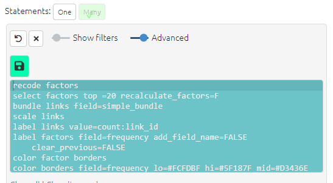

# Causal Map Functions

This is a set of functions for manipulating and simplifying causal maps. 

Load example data:

```
devtools::install_github("stevepowell99/CausalMapFunctions")
library(CausalMapFunctions)
example2
```

Visualise it:

```
example2 %>% make_interactive_map
```

These functions are used in the [Causal Map App](https://causalmap.shinyapps.io/CausalMap2/). This app is completely free to use for analysis; to create and code larger mapfiles you will need a subscription. Or you can use these functions to work completely independently from the Causal Map app.

There is more documentation of the functions in our [Vignette](articles/examples.html), however this is out of date. 

The documentation of the functions in this package is unfortunately incomplete. 

If you are interested and want more information, get in touch by raising an issue at GitHub or writing to steve@causalmap.app.  

There is extensive documentation of the app in our [Guide](https://guide.causalmap.app/). 

You can get a good idea of how many of the functions work by trying out the filters in the dashboard at the [Causal Map app](https://causalmap.shinyapps.io/CausalMap2).


When you click any of the views in the dashboard, the corresponding filter loads in the Advanced Editor on the left.



The text in the Advanced Editor is processed by the function `parse_commands`. So for example the command `scale links` above is interpreted converted into the function `pipe_scale_links()`. All the functions in the editor are `pipe_` functions which mean they are applied one after the other to the currently loaded mapfile.

## Motivation

There are many existing tools for analysing systems diagrams and also undirected graphs, we identified a need for a tool for analysing the kind of causal maps produced in evaluation research such as programme theories where:

- there may be many causal factors, with long text labels 
- the text labels are important because they may be used for searching and filtering
- causal factors may be nested into causal hierarchies
- there may be many co-terminal links between pairs of factors which should sometimes merged and sometimes not
- the main focus is often on a flow of influence from a small set of intervention variables to a small set of focused variables downstream of them, such as key outcomes 

## Features

- As well as an interactive map, the package wraps DiagrammeR and igraph to produce left-to-right layouts which are particularly suitable for directed maps.
- The package provides many new tools for analysing and aggregating causal maps such as `pipe_trace_paths()`, alongside familiar node and graph metrics.
- For hierarchical coding, tools are provided to zoom in and out of individual hierarchies and entire maps.

